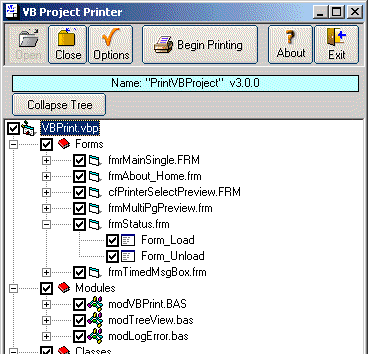



## Source Code Documenter v3\.6

### Description

(Updated 11/09/04) This application will give you a well-formatted printout that includes a cover page, a table of contents and a project summary. You can select what will be printed, from the entire project, a single procedure in a module, or just the project summary. You can send the output to the screen (preview) or the printer. You can also export the results to a RTF file, HTML file, or a bitmap file (using the preview). It also has some additional printing options to save paper. Includes a stand-alone version as well a VB add-in. It uses VB6's TreeView control, so it will not work with older version of VB. (Project's name change: was 'A Project's Source Code Printer).
 
### More Info
 

             |
---                |---
**Submitted On**   |2004-11-09 12:54:48
**By**             |[Morgan Haueisen](https://github.com/Planet-Source-Code/PSCIndex/blob/master/ByAuthor/morgan-haueisen.md)
**Level**          |Advanced
**User Rating**    |4.9 (113 globes from 23 users)
**Compatibility**  |VB 6\.0
**Category**       |[Complete Applications](https://github.com/Planet-Source-Code/PSCIndex/blob/master/ByCategory/complete-applications__1-27.md)
**World**          |[Visual Basic](https://github.com/Planet-Source-Code/PSCIndex/blob/master/ByWorld/visual-basic.md)
**Archive File**   |[Source\_Cod1816431192004\.zip](https://github.com/Planet-Source-Code/morgan-haueisen-source-code-documenter-v3-6__1-51425/archive/master.zip)

